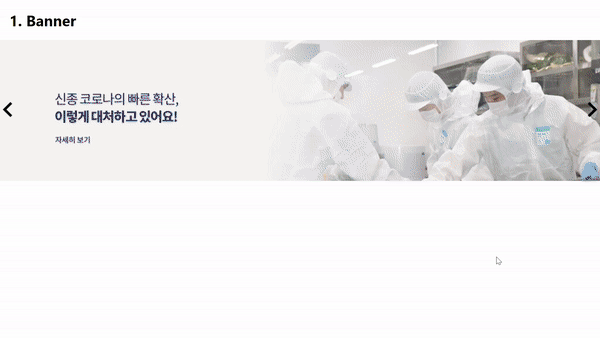
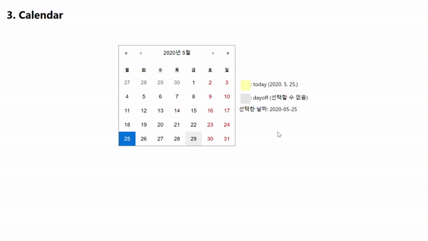

# test

Live Demo: https://project1-26a74.web.app/

cors 플러그인 설치가 필요합니다.
(https://chrome.google.com/webstore/detail/allow-cors-access-control/lhobafahddgcelffkeicbaginigeejlf?hl=en)

## Features

배너 carousel
5초마다 무한히 반복되는 배너입니다.
캐러셀 구현에는 pure-react-carousel 라이브러리를 사용했습니다.
서버에서 데이터를 가져올때 axios 라이브러리 및 async await를 사용했습니다

상품 목록
받아온 데이터는 redux를 통해 상태관리를 할수있도록 store에 저장 했습니다.
tab기능을 js & css 로 구현했습니다.

캘린더
react-calendar 라이브러리를 통해 캘린더를 구현했습니다.
서버에서 받아온 휴일을 Date 오브젝트로 바꿔서 react-calendar와 연결후
휴일에는 클릭이 되지 않도록 기능을 구현 했습니다.
달력 옆에 moment.js라이브러리를 통해 "yyyy-MM-dd" 형식으로 선택한 날짜를 출력할수있도록 했습니다.
또한 오늘 날짜는 노란색으로 표시하도록 했습니다.

## Technologies

- react
- redux
- axios
- pure-react-carousel
- react-calendar
- moment
